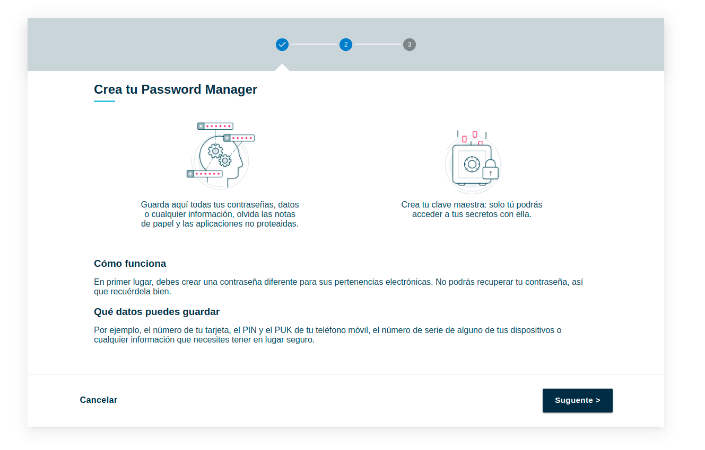
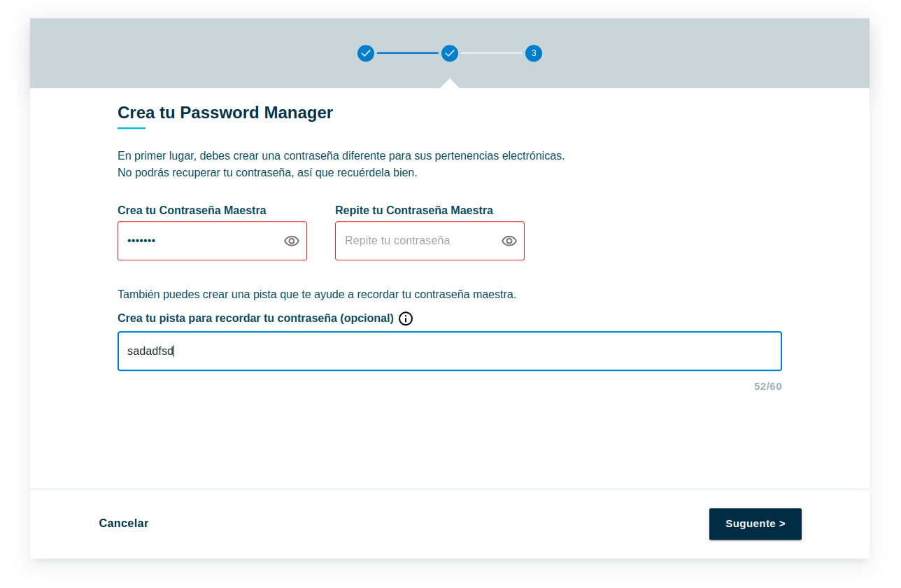
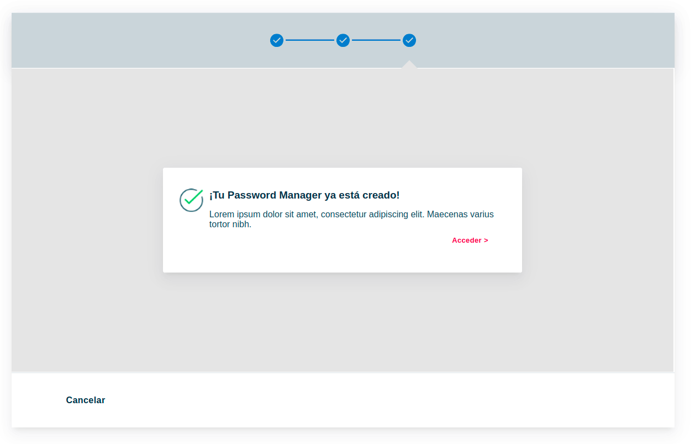
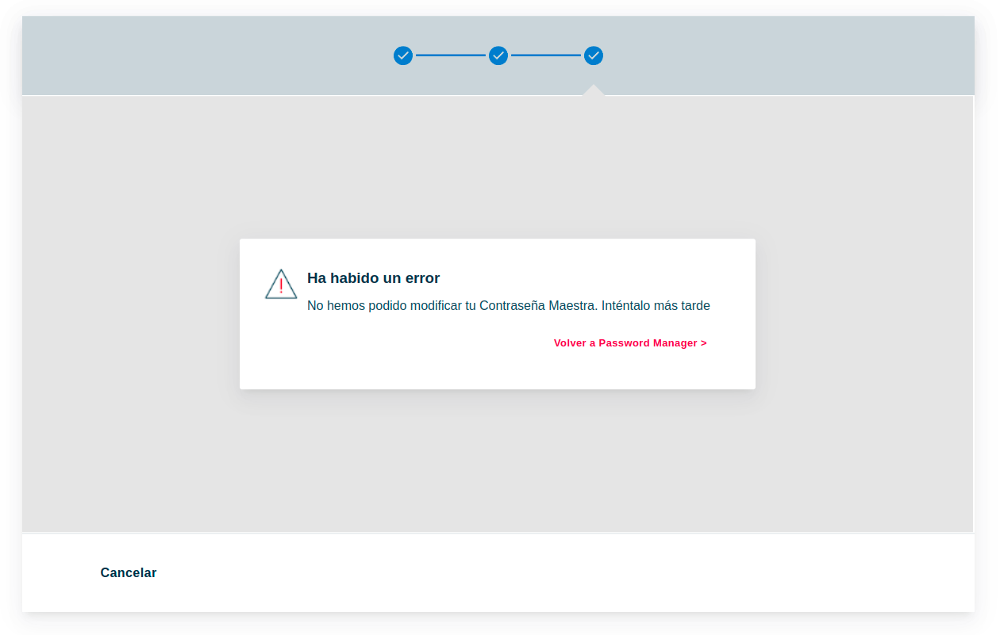

# Documentación para la asignación de la prueba

## Available Scripts

In the project directory, to establish dependencies:

### `yarn install` or  `npm install`

In the project directory, you can run:

### `yarn start`

Runs the app in the development mode.\
Open [http://localhost:3000](http://localhost:3000) to view it in your browser.

### `Para la asignación de la prueba se utilizaron las siguientes técnologias`

- React.js componentes funcionales - como la base
- React-Router-Dom version 6 - navegación dentro de la aplicación
- Redux - almacenamiento del state
- React - Redux - vinculación de React y Redux
- Redux - Thunk - para mejorar las capacidades de Redux cuando se trata de código asíncrono
- Material - UI - visualización de los componentes individuales

### `Tiempo dedicado al proyecto`

Se emplearon unas 23 horas de tiempo 

### `Características del proyecto a tener en cuenta`

- También está activo el Stepper del navegador superior.

### `Problemas que he encontrado`

- Stepper - Sin una especificación clara, supuse que el módulo también debía estar activo. Se dedicó tiempo a sincronizarlo con los botones de navegación. Como resultado, resultó que el módulo de interfaz de usuario Stepper Material era difícil de preconstruir. Debería haberse hecho con estilos de bloque desde el principio.

- Imput de la conraseñas. Hasta ahora no he encontrado un imput adecuado que se adapte al diseño. O bien crear uno nuevo desde cero.

### `Conclusiones`
Una tarea interesante. Lo bien que lo haya hecho depende de vosotros. 
Por favor, pido dejar vuestros opiniones.

### `Pagina 1`

### `Pagina 2`

### `Pagina 3`

